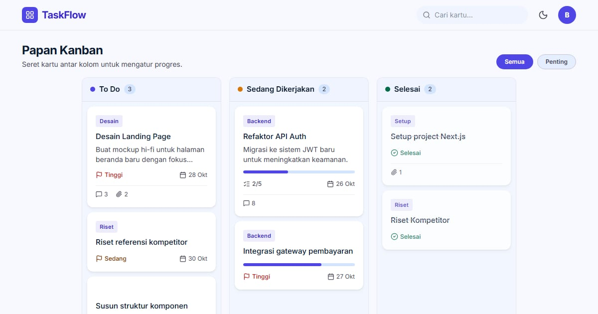

# TaskFlow — Papan Kanban

**Demo live:** https://todo-kanban-one.vercel.app



> Data tersimpan di browser (localStorage), tanpa backend.

Papan Kanban dengan **drag & drop** antar kolom (To Do → In Progress → Done). Varian "interaksi & UX kompleks" dari portfolio.

## Fitur
- **Drag & drop** kartu antar kolom + reorder dalam kolom (`@dnd-kit`)
- Pointer & **keyboard sensor** (aksesibel), `DragOverlay` untuk preview saat menyeret
- Tambah kartu per kolom, hapus kartu, penghitung per kolom
- **Persist ke localStorage**
- Kolom scroll horizontal di layar kecil

## Stack
Next.js 15 · React 19 · Tailwind v4 · @dnd-kit/core · @dnd-kit/sortable · lucide-react

## Struktur
- `components/KanbanBoard.jsx` — DndContext, state board, handler drag (onDragStart/Over/End)
- `components/Column.jsx` — kolom droppable + SortableContext + form tambah
- `components/Card.jsx` — kartu sortable (grip handle)
- `lib/useLocalStorage.js` — hook persist

## Menjalankan
```bash
npm install
npm run dev
```

---

Bagian dari koleksi 3 aplikasi to-do di [PortalTodo](https://portal-todo.vercel.app). Dibuat oleh [PintuWeb](https://pintuweb.com), jasa pembuatan website.
